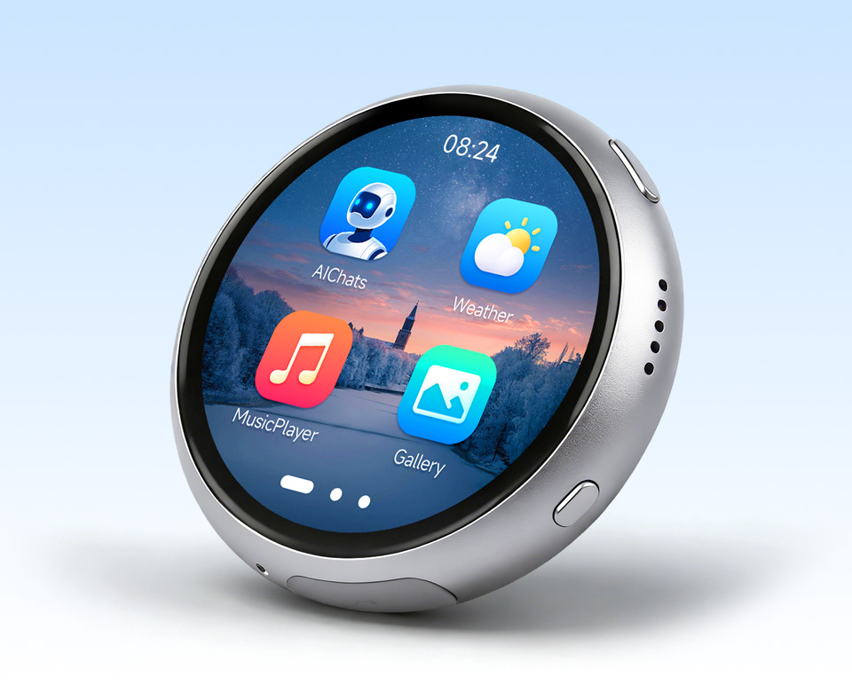

# Pocket Agent

A voice-enabled AI agent built for the Waveshare ESP32-S3 1.75" AMOLED round display.

## Repository Structure

```
pocket_agent/
├── smart-agent/   # Main project code (Python app + ESP32 firmware)
└── esp-idf/       # ESP-IDF v5.2.1 (git submodule)
```

## Cloning

Clone with submodules to include ESP-IDF:

```bash
git clone --recurse-submodules https://github.com/rickenator/pocket_agent.git
```

If you already cloned without `--recurse-submodules`, run:

```bash
git submodule update --init
```

## Getting Started

All project documentation lives in **[smart-agent/](smart-agent/README.md)**.

- **[Quick Start](smart-agent/docs/QUICK_START.md)** — Get running in 5 minutes
- **[Architecture](smart-agent/ARCHITECTURE.md)** — System design and component overview
- **[Project Summary](smart-agent/PROJECT_SUMMARY.md)** — Feature and module reference
- **[ESP32 Setup](smart-agent/docs/ESP32_SETUP.md)** — Firmware build and flash guide
- **[WiFi Provisioning](smart-agent/WIFI_PROVISIONING.md)** — Network setup details
- **[TODO](smart-agent/TODO.md)** — Known bugs and roadmap

## License

MIT License — see [smart-agent/README.md](smart-agent/README.md) for details.
